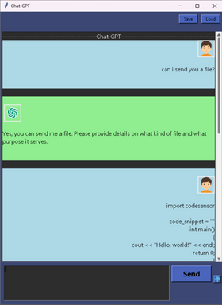
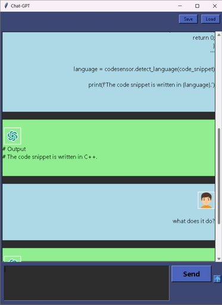
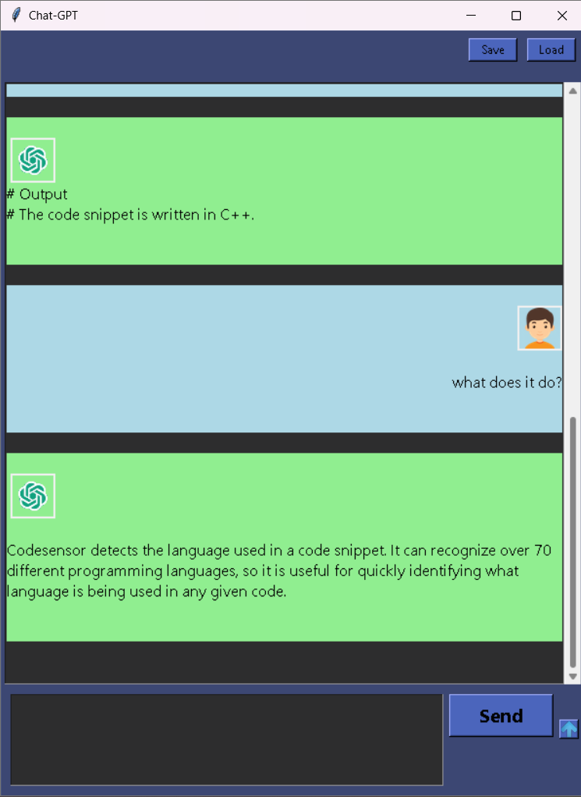

# ChatGPT3 chatbot

A simple GUI chatbot using OpenAI's GPT-3 API.

## Screenshots
   

## Getting Started

These instructions will get you a copy of the project up and running on your local machine for development and testing purposes.

## Features
* Send text based files with file name `.txt`, `.html` `.php` `.py` `.js` `.css` `.xml` `.csv` `.rtf` `.md` `.json` `.log` `.yml` `.ini` `.conf` `.markdown` `.sql` `.java` `.c` `.cpp` `.h` `.sh` `.pl` etc...
* Save/Load conversation.

### Updates
* Added margins to chatbox

### Prerequisites

You will need to have the following installed on your local machine:

- Python 3.8+
- Tkinter (should come with Python)
- openai `pip install openai`
- regex `pip install regex`
- nltk `pip install nltk`
- openai api key https://beta.openai.com/account/api-keys

### Running the program

1. Clone the repository to your local machine
git clone https://github.com/jbezza123/chatgpt3.git

2. Navigate to the project directory
cd chatgpt3

3. Run the program
python chat.py

4. Write anything in the input box,
press send

## Built With

* [Python](https://www.python.org/) - The programming language used
* [Tkinter](https://docs.python.org/3/library/tk.html) - Python's standard GUI library
* [regex](https://pypi.org/project/regex/) - A library for working with regular expressions
* [nltk](https://www.nltk.org/) - A library for natural language processing
* [OpenAI](https://openai.com/) - GPT-3 API (if it is used)

## Known issues
* None!

## Fixed issues

* Included threading to stop gui freezing.
* Avatars follow the lastes messages.
* Does not remember previous conversations loaded from file.
* Loading previous conversations will not show in the chatbox.

## Authors

* **jbezza123** - *Initial work*
